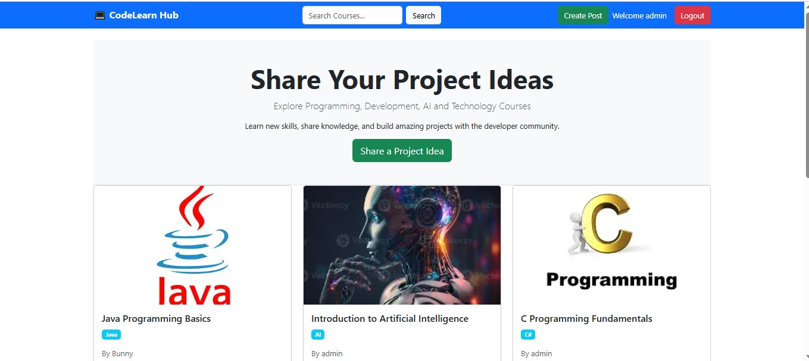
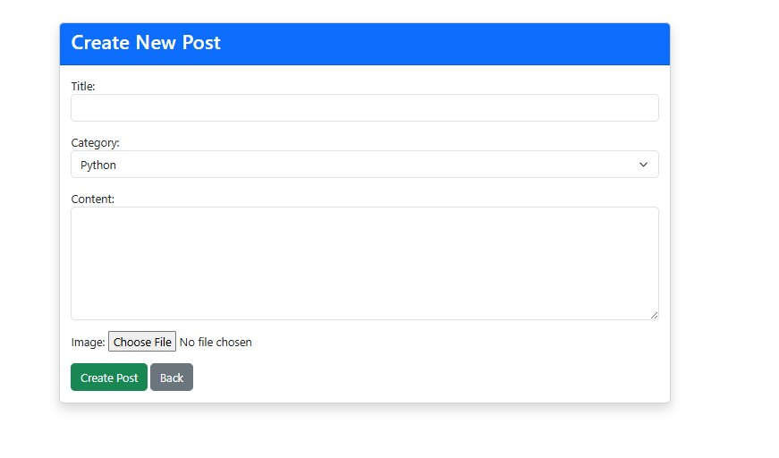
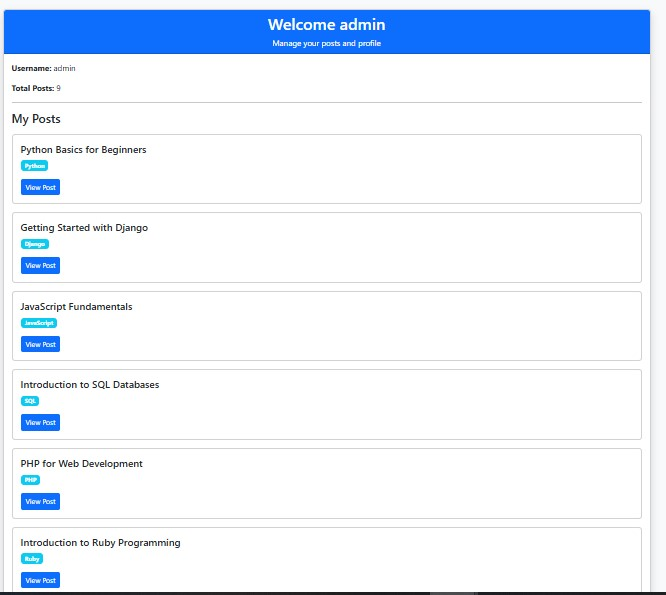
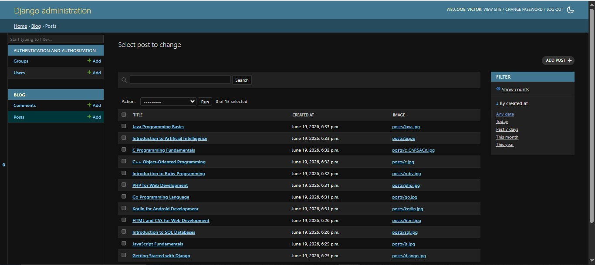

# CodeLearn Hub

A Django-based learning platform where users can explore programming courses, share project ideas, and interact through comments.

## Features

- User Signup & Login
- Create, Update and Delete Posts
- Categories
- Search Functionality
- Comments System
- User Profile
- Bootstrap UI

## Technologies Used

- Python
- Django
- HTML
- CSS
- Bootstrap
- SQLite

## Screenshots

### Home Page

### Create Post

### Profile Page

### Admin Panel

## Author

Polagani Victor Paul

GitHub: https://github.com/bunny0068

LinkedIn: https://linkedin.com/in/polagani-victor-paul
